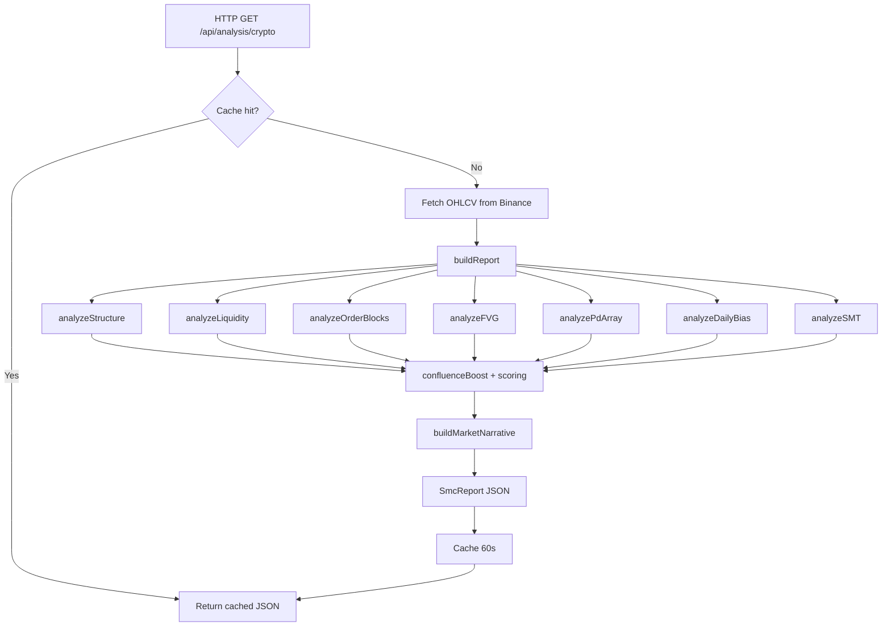
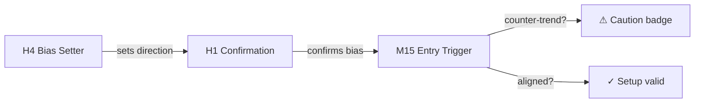
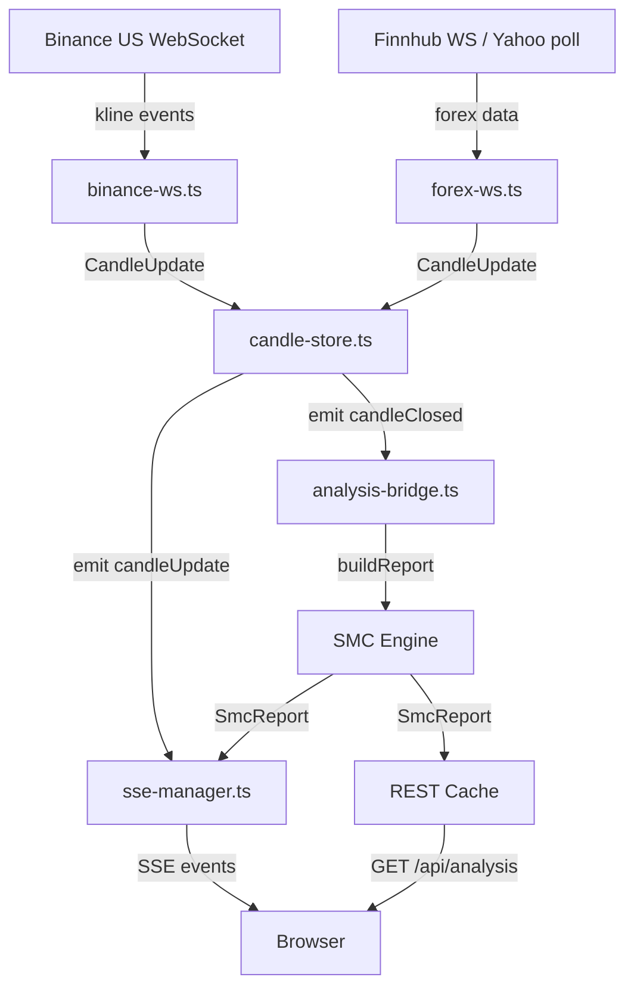

# Architecture — SMC Pulse Predict

## Complete Folder Tree

```
workspace/
├── artifacts/
│   ├── api-server/                     # Node.js/Express backend
│   │   ├── src/
│   │   │   ├── index.ts                # Process entry, port binding
│   │   │   ├── app.ts                  # Express app factory, middleware mount
│   │   │   ├── lib/
│   │   │   │   ├── logger.ts           # Pino structured logger
│   │   │   │   ├── fetchers/
│   │   │   │   │   ├── binance.ts      # Binance REST OHLCV fetch (delegates to Yahoo)
│   │   │   │   │   └── yahoo.ts        # Yahoo Finance REST OHLCV fetch
│   │   │   │   ├── realtime/
│   │   │   │   │   ├── binance-ws.ts    # Binance WebSocket (crypto, multi-symbol)
│   │   │   │   │   ├── forex-ws.ts      # Finnhub WS / Yahoo polling (forex)
│   │   │   │   │   ├── candle-store.ts   # In-memory candle accumulator
│   │   │   │   │   ├── sse-manager.ts    # SSE client registry + broadcast
│   │   │   │   │   ├── analysis-bridge.ts # candleClosed → buildReport → cache + SSE
│   │   │   │   │   └── index.ts         # Barrel exports
│   │   │   │   ├── loop/               # Agent Loop Engine (NEW)
│   │   │   │   │   ├── types.ts         # LoopConfig, LoopStep, Decision, GuardrailConfig
│   │   │   │   │   ├── LoopContext.ts    # Working memory, iteration/step tracking
│   │   │   │   │   ├── AgentGuardrails.ts # Confidence floor, risk limits, confluence checks
│   │   │   │   │   ├── AgentLoop.ts     # Central orchestrator (Observe→→→Update)
│   │   │   │   │   └── MonitoringManager.ts # Background candle-close monitor registry
│   │   │   │   ├── memory/             # Memory Systems (NEW)
│   │   │   │   │   ├── EpisodicMemory.ts # Past signals/outcomes via TradeLedgerService
│   │   │   │   │   ├── SemanticMemory.ts # Patterns + agent_memory table (procedural rules)
│   │   │   │   │   ├── MemoryService.ts # Facade combining both tiers
│   │   │   │   └── vector/          # Qdrant vector database
│   │   │   │       ├── types.ts     # VectorSignalRecord, SimilarSetupResult
│   │   │   │       └── QdrantMemory.ts # storeSignal, findSimilar, formatForPrompt
│   │   │   │   ├── harness/            # Observability (NEW)
│   │   │   │   │   ├── types.ts         # TraceSpan, RunEvaluation types
│   │   │   │   │   ├── LoopTracer.ts    # Step-level tracing + DB persistence
│   │   │   │   │   └── LoopEvaluator.ts # Post-run scoring + memory ingestion
│   │   │   │   ├── evaluation/      # LLM-as-Judge evaluator (Ragas-equivalent)
│   │   │   │   ├── news/            # NewsFetcher, TextChunker, PdfParser
│   │   │   │   ├── integrations/
│   │   │   │   │   └── tradingview/  # TV Desktop CDP integration
│   │   │   │   │       ├── types.ts          # Connection config, chart state types
│   │   │   │   │       ├── config.ts         # Env-var seeded config singleton
│   │   │   │   │       ├── index.ts          # Barrel exports
│   │   │   │   │       ├── reconciliation.ts # SMC vs TV data comparison
│   │   │   │   │       ├── mcp-tools.ts      # 11 TV MCP tools
│   │   │   │   │       ├── cdp/
│   │   │   │   │       │   ├── connection.ts # Puppeteer CDP singleton, keyboardPress/mouseClick
│   │   │   │   │       │   ├── chart.ts      # getBars, getSymbol, getTimeframe
│   │   │   │   │       │   └── actions.ts    # changeSymbol/Timeframe, draw*, syncSmcLevels
│   │   │   │   │       └── tv-data-fallback.ts # getCandlesWithFallback helper
│   │   │   │   ├── observability/   # Langfuse tracing wrapper
│   │   │   │   ├── optimization/    # Prompt optimizer (DSPy-equivalent)
│   │   │   │   └── smc/
│   │   │   │       ├── config.ts       # Shared tuning constants (ATR, lookback, etc.)
│   │   │   │       ├── types.ts        # All shared TypeScript interfaces
│   │   │   │       ├── structure.ts    # Pivot + BOS/CHoCH + phase detection
│   │   │   │       ├── liquidity.ts    # Liquidity pool scanner
│   │   │   │       ├── order-blocks.ts # OB/Breaker detection + confidence scoring
│   │   │   │       ├── fvg.ts          # Fair Value Gap detection
│   │   │   │       ├── pd-array.ts     # Premium/Discount/Equilibrium zones
│   │   │   │       ├── daily-bias.ts   # HTF 1D bias computation
│   │   │   │       ├── smt.ts          # SMT divergence detection
│   │   │   │       └── report.ts       # Orchestrator — assembles all modules
│   │   │   └── routes/
│   │   │       ├── index.ts            # Router mount
│   │   │       ├── analysis.ts         # GET /api/analysis/{crypto,forex} + cache
│   │   │       ├── agents.ts           # POST /api/agents/{ask,pipeline} + Fireworks AI
│   │   │       ├── agent-loop.ts      # POST /api/agent-loop/{run,start/stop-monitoring}
│   │   │       │                      # GET  /api/agent-loop/{status,runs,memory}
│   │   │       ├── stream.ts           # GET /api/stream/:symbol (SSE real-time)
│   │   │       ├── symbols.ts          # GET /api/symbols
│   │   │       └── health.ts           # GET /api/healthz
│   │   ├── package.json
│   │   └── tsconfig.json
│   │
│   ├── liquidity-hunter/               # React frontend SPA
│   │   ├── src/
│   │   │   ├── main.tsx                # React root mount
│   │   │   ├── App.tsx                 # Router setup (Wouter)
│   │   │   ├── pages/
│   │   │   │   ├── dashboard.tsx       # Main page — all state lives here
│   │   │   │   ├── AgentLoop.tsx       # Agent Loop dashboard page (NEW)
│   │   │   │   └── not-found.tsx       # 404 fallback
│   │   │   ├── components/
│   │   │   │   ├── ConfluenceCard.tsx  # Multi-TF cascade summary card
│   │   │   │   ├── ConfluenceSheet.tsx # Full-screen multi-TF deep dive
│   │   │   │   ├── IntelligenceSheet.tsx # Single-TF full analysis overlay
│   │   │   │   ├── ChartView.tsx       # Full-screen chart (LW Charts v5)
│   │   │   │   ├── AgentChat.tsx       # Q&A chat with AI analyst
│   │   │   │   ├── AgentPipeline.tsx   # 4-agent sequential pipeline panel
│   │   │   │   └── ui/                 # shadcn/ui primitives
│   │   │   └── hooks/
│   │   │       └── use-mobile.tsx
│   │   ├── public/
│   │   ├── package.json
│   │   ├── vite.config.ts
│   │   └── tsconfig.json
│   │
│   └── mockup-sandbox/                 # Canvas/design preview server
│
├── lib/
│   ├── api-spec/
│   │   └── openapi.yaml               # OpenAPI 3.1 contract
│   ├── api-client-react/
│   │   └── src/generated/
│   │       └── api.schemas.ts         # Manually maintained TS types + React Query hooks
│   └── api-zod/
│       └── src/generated/
│           └── api.zod.ts             # Zod schemas
│
├── deploy/
│   ├── local/                            # CPU-friendly Docker Compose (Intel/AMD laptop)
│   │   ├── docker-compose.yml
│   │   ├── .env.example
│   │   └── README.md
│   └── amd-developer-cloud/              # AMD MI300X GPU Docker Compose (vLLM + ROCm)
│       ├── docker-compose.yml
│       ├── .env.amd
│       ├── setup.sh
│       └── README.md
│
├── pnpm-workspace.yaml
├── package.json
├── README.md
├── ARCHITECTURE.md
├── TECHNICAL_REPORT.md
├── FRONTEND.md
├── BACKEND.md
├── AI_SYSTEM.md
└── ICT_IMPLEMENTATION.md
```

---

## Folder Responsibilities

| Path | Responsibility |
|---|---|
| `artifacts/api-server/src/lib/smc/` | The entire ICT/SMC algorithmic engine — no HTTP concerns |
| `artifacts/api-server/src/lib/fetchers/` | Market data retrieval from external APIs |
| `artifacts/api-server/src/routes/` | HTTP routing, validation, caching, streaming |
| `artifacts/liquidity-hunter/src/pages/` | Page-level state orchestration |
| `artifacts/liquidity-hunter/src/components/` | Stateful and display UI components |
| `lib/api-client-react/` | Shared type contracts + data fetching hooks |
| `lib/api-spec/` | OpenAPI contract (source of truth for the API surface) |

---

## Frontend Component Hierarchy

```
App (Wouter router)
├── Dashboard (page)
│   ├── Header ...
│   ├── ConfluenceCard
│   ├── TfAgentCard × N
│   │   └── IntelligenceSheet
│   │       ├── AgentPipeline
│   │       └── AgentChat
│   ├── ConfluenceSheet / IntelligenceSheet / ChartView (overlays)
│   └── Session footer bar
└── AgentLoop (page)                    ← NEW
    └── AgentLoopDashboard
        ├── Loop Runner (Run Loop tab)
        ├── Monitor Manager (Monitors tab)
        ├── Run History (History tab)
        └── Memory Viewer (Memory tab)
```

---

## Backend Module Hierarchy

```
app.ts (Express factory)
└── routes/index.ts
    ├── routes/health.ts         GET /api/healthz
    ├── routes/symbols.ts        GET /api/symbols
    ├── routes/analysis.ts       GET /api/analysis/{crypto,forex}
    │   └── lib/smc/report.ts   buildReport()
    │       ├── structure.ts    analyzeStructure()
    │       ├── liquidity.ts    analyzeLiquidity()
    │       ├── order-blocks.ts analyzeOrderBlocks()
    │       ├── fvg.ts          analyzeFVG()
    │       ├── pd-array.ts     analyzePdArray()
    │       ├── daily-bias.ts   analyzeDailyBias()
    │       └── smt.ts          analyzeSMT()
    ├── routes/agents.ts         POST /api/agents/{ask,pipeline}
    │   └── Fireworks AI SSE stream
    ├── routes/agent-loop.ts     POST /api/agent-loop/{run,start/stop-monitoring}
    │   │                        GET  /api/agent-loop/{status,runs,memory}
    │   ├── lib/loop/AgentLoop.ts      Central orchestrator
    │   │   ├── LoopContext.ts         Working memory/session state
    │   │   ├── AgentGuardrails.ts     Safety checks
    │   │   └── MonitoringManager.ts   Background monitor registry
    │   ├── lib/memory/MemoryService.ts
    │   │   ├── EpisodicMemory.ts      Past signals/outcomes
    │   │   └── SemanticMemory.ts      Patterns + procedural rules
    │   └── lib/harness/
    │       ├── LoopTracer.ts          Step tracing + DB persistence
    │       └── LoopEvaluator.ts       Post-run scoring
    └── routes/stream.ts         GET /api/stream/:symbol (SSE) + /status
        ├── lib/realtime/binance-ws.ts   Binance US WS (crypto)
        ├── lib/realtime/forex-ws.ts     Finnhub WS / Yahoo polling (forex)
        ├── lib/realtime/candle-store.ts  In-memory candle accumulator
        ├── lib/realtime/sse-manager.ts   SSE client broadcaster
        └── lib/realtime/analysis-bridge.ts  candleClosed → buildReport → cache + SSE
```

---

## Data Flow

### Analysis Request Lifecycle

```
Browser
  │  GET /api/analysis/crypto?symbol=BTCUSDT&timeframe=4h&correlatedSymbol=ETHUSDT
  ▼
routes/analysis.ts
  │  Check in-memory cache (key: "crypto|BTCUSDT|4h|ETHUSDT")
  │  Cache hit → return cached JSON (< 1ms)
  │  Cache miss ↓
  ▼
Promise.all([
  fetchBinanceCandles(BTCUSDT, 4h)        → up to 300 candles
  fetchBinanceDailyCandles(BTCUSDT)       → up to 60 daily candles
  fetchBinanceCandles(ETHUSDT, 4h)        → correlated candles
])
  ▼
buildReport(candles, "BTCUSDT", "crypto", "4h", options)
  │
  ├── analyzeStructure(candles, tf)        → StructureResult
  ├── analyzeFVG(candles, market)          → FairValueGap[]
  ├── analyzeLiquidity(candles, tf, mkt)   → LiquidityResult
  ├── analyzeOrderBlocks(candles, fvg)     → OrderBlock[]
  ├── analyzePdArray(candles, tf)          → PdArrayResult
  ├── analyzeDailyBias(dailyCandles)       → DailyBiasResult
  ├── analyzeSMT(candles, corrCandles)     → SmtDivergence
  │
  ├── HTF bias → OB confidence adjustment
  ├── confluenceBoost() → scored DrawTarget[]
  ├── deriveSessionState()                 → string
  └── buildMarketNarrative()               → string
  ▼
SmcReport JSON (cached 60s)
  ▼
Browser → TanStack Query → React state → UI render
```

### TV Desktop Data Fallback

When the candle store is empty and external APIs are unreachable:

```
SMC Tool or Agent Loop needs candle data
  │  candleStore.getCandles(sym, tf)  → empty
  ▼
getCandlesWithFallback(sym, tf)
  ├── 1. Candle Store check → cached EURUSD (not BTCUSDT)
  ├── 2. TV Desktop CDP:
  │     ├── connect via Puppeteer to 127.0.0.1:9222
  │     ├── page.evaluate(() → _exposed_chartWidgetCollection..._source.bars())
  │     ├── returns 300 candles as [{time,open,high,low,close,volume}]
  │     └── seeds candleStore for subsequent calls
  └── 3. Returns candle array to SMC tool
```

### TV Drawing Lifecycle

```
User clicks [TV] on timeframe card (or "Draw Levels" in TV panel)
  │
  POST /api/agent-loop/tv-draw { action: "levels", symbol, timeframe }
  ▼
tv-draw route handler
  ├── 1. Connect if not connected (Puppeteer → 127.0.0.1:9222)
  ├── 2. Switch chart: evaluate src.setSymbol() + src.setInterval()
  ├── 3. Wait for bars to load (~3-6s)
  ├── 4. Compute BSL/SSL/Current via evaluate()
  ├── 5. For each level:
  │     ├── keyboardPress("Alt+h")       ← activate Horizontal Ray
  │     ├── mouseClick(x, y)             ← place at exact price coordinate
  │     └── wait 1s
  ├── 6. keyboardPress("Escape")         ← deselect tool
  └── 7. Return { levels, logs }
```

### AI Agent Request Lifecycle

```
User types question or taps pipeline
  ▼
POST /api/agents/ask   { question, report, history }
     /api/agents/pipeline { report }
  ▼
buildSystemPrompt(report)   ← injects full SmcReport context as structured text
  ▼
fetch → Fireworks AI SSE stream
  ▼
Server reads stream → re-emits SSE chunks to browser
  ▼
Frontend EventSource reads token deltas → appends to UI
```

### Agent Loop Lifecycle (NEW)

```
POST /api/agent-loop/run { symbol, timeframe, market }
  ▼
AgentLoop.run(report, trigger)
  │
  ├── 1. OBSERVE     — store SmcReport in LoopContext, check guardrails
  ├── 2. INTERPRET   — call 8 SMC tools via toolRegistry
  ├── 3. REASON      — build prompt from interpreted data + memory, call LLM
  ├── 4. DECIDE      — validate Decision through AgentGuardrails
  ├── 5. ACT         — generate signal via SignalGenerator, log to ledger
  ├── 6. EVALUATE    — score run via LoopEvaluator
  └── 7. UPDATE      — persist trace to DB via LoopTracer, store memory entries
  ▼
SSE stream: loop_step → loop_decision → loop_signal → loop_complete
```

---

## State Management

The frontend has no global state manager (no Redux/Zustand). State is split into:

| State | Location | Mechanism |
|---|---|---|
| Market, symbol, TF style, SMT toggle | `dashboard.tsx` | `useState` |
| Analysis reports (all 7 TFs) | `dashboard.tsx` | TanStack Query (server state) |
| Which sheet is open | `dashboard.tsx` | `useState<sheet | null>` |
| Chart open flag | `dashboard.tsx` | `useState<boolean>` |
| Chart active TF | `ChartView.tsx` | `useState<string>` |
| Agent conversation | `AgentChat.tsx` | `useState<Message[]>` |
| Pipeline streaming output | `AgentPipeline.tsx` | `useState<AgentResult[]>` |
| Agent loop SSE events | `AgentLoopDashboard.tsx` | `useState<LoopStepEvent[]>` |
| Active monitors | `AgentLoopDashboard.tsx` | `useState from GET /api/agent-loop/status` |
| Run history | `AgentLoopDashboard.tsx` | `useState from GET /api/agent-loop/runs` |
| Memory entries | `AgentLoopDashboard.tsx` | `useState from GET /api/agent-loop/memory` |
| Real-time stream connection | `useRealtimeStream` hook | `useState<LiveTfData>` (live prices per TF) |
| SSE candle data | `useRealtimeStream` hook | `useState<CandleData[]>` (live candles for chart) |
| WS connection status | `useRealtimeStream` hook | `useState<boolean>` (green dot indicator) |

---

## API Communication

All API communication goes through generated TanStack Query hooks in `lib/api-client-react`:

```ts
// Generated hook (manually maintained)
const { data: report, isLoading, error } = useAnalyzeCrypto({
  symbol: "BTCUSDT",
  timeframe: "4h",
  correlatedSymbol: "ETHUSDT",
});
```

AI endpoints use raw `EventSource` / `fetch` with SSE in `AgentChat.tsx` and `AgentPipeline.tsx`.

Real-time streaming uses a dedicated SSE endpoint:

```ts
// GET /api/stream/:symbol?timeframes=1m,5m,15m
// Returns SSE events: connected, candle_update, candle_closed, report_update
// Frontend consumes via useRealtimeStream() hook in lib/realtime.ts
```

### API Endpoint Summary

| Method | Path | Description |
|---|---|---|
| GET | `/api/healthz` | Health check |
| GET | `/api/symbols` | Supported symbols |
| GET | `/api/analysis/crypto` | Full SMC report (crypto, cached 60s) |
| GET | `/api/analysis/forex` | Full SMC report (forex, cached 60s) |
| POST | `/api/agents/ask` | AI Q&A (SSE streaming) |
| POST | `/api/agents/pipeline` | 4-agent pipeline (SSE streaming) |
| POST | `/api/agents/ask-mcp` | MCP tool-calling agent (SSE streaming) |
| POST | `/api/agent-loop/run` | Agent Loop one-shot cycle (SSE streaming) |
| POST | `/api/agent-loop/start-monitoring` | Start background candle-close monitor |
| POST | `/api/agent-loop/stop-monitoring` | Stop background monitor |
| GET | `/api/agent-loop/status` | Active monitors list |
| GET | `/api/agent-loop/runs` | Historical loop runs |
| GET | `/api/agent-loop/runs/:id` | Detailed run trace with steps |
| POST | `/api/agent-loop/runs/:id/evaluate` | Trigger post-run evaluation |
| GET | `/api/agent-loop/memory` | Query semantic memory entries |
| POST | `/api/agent-loop/memory` | Store manual memory entry |
| DELETE | `/api/agent-loop/memory/:id` | Delete memory entry |
| GET | `/api/stream/:symbol` | Real-time candle stream (SSE) |
| GET | `/api/stream/status` | Real-time system status (debug) |

---

## Mermaid Diagrams

### Analysis Pipeline



### Multi-TF Cascade



### Real-Time Data Pipeline



### Real-Time Flow (per candle close)

```
Binance WS / Forex Poller
  → candleStore.applyUpdate({isClosed: true})
    → emits "candleClosed"
      → sseManager: broadcasts SSE "candle_closed" to browsers
      → analysis-bridge:
          1. candleStore.getCandles() → fresh candle array
          2. buildReport() → fresh SmcReport
          3. updateCachedReport() → REST cache pre-warmed
          4. sseManager.broadcastReport() → SSE "report_update"
            → browser: onReportUpdate → setQueryData → instant UI update
```
