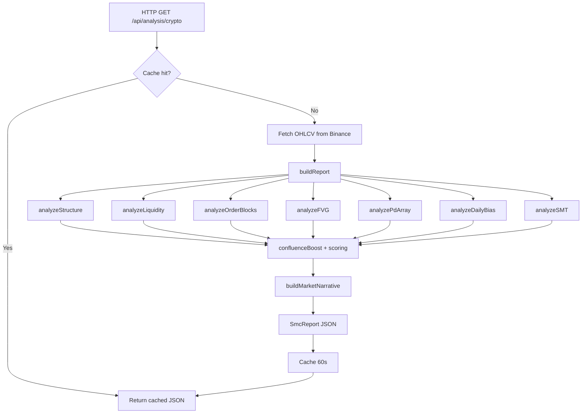
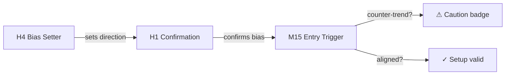

# Architecture — SMC Pulse Predict

## Complete Folder Tree

```
workspace/
├── artifacts/
│   ├── api-server/                     # Node.js/Express backend
│   │   ├── src/
│   │   │   ├── index.ts                # Process entry, port binding
│   │   │   ├── app.ts                  # Express app factory, middleware mount
│   │   │   ├── lib/
│   │   │   │   ├── logger.ts           # Pino structured logger
│   │   │   │   ├── fetchers/
│   │   │   │   │   ├── binance.ts      # Binance REST OHLCV fetch
│   │   │   │   │   └── yahoo.ts        # Yahoo Finance REST OHLCV fetch
│   │   │   │   └── smc/
│   │   │   │       ├── config.ts       # Shared tuning constants (ATR, lookback, etc.)
│   │   │   │       ├── types.ts        # All shared TypeScript interfaces
│   │   │   │       ├── structure.ts    # Pivot + BOS/CHoCH + phase detection
│   │   │   │       ├── liquidity.ts    # Liquidity pool scanner
│   │   │   │       ├── order-blocks.ts # OB/Breaker detection + confidence scoring
│   │   │   │       ├── fvg.ts          # Fair Value Gap detection
│   │   │   │       ├── pd-array.ts     # Premium/Discount/Equilibrium zones
│   │   │   │       ├── daily-bias.ts   # HTF 1D bias computation
│   │   │   │       ├── smt.ts          # SMT divergence detection
│   │   │   │       └── report.ts       # Orchestrator — assembles all modules
│   │   │   └── routes/
│   │   │       ├── index.ts            # Router mount
│   │   │       ├── analysis.ts         # GET /api/analysis/{crypto,forex} + cache
│   │   │       ├── agents.ts           # POST /api/agents/{ask,pipeline} + Fireworks AI
│   │   │       ├── symbols.ts          # GET /api/symbols
│   │   │       └── health.ts           # GET /api/health
│   │   ├── package.json
│   │   └── tsconfig.json
│   │
│   ├── liquidity-hunter/               # React frontend SPA
│   │   ├── src/
│   │   │   ├── main.tsx                # React root mount
│   │   │   ├── App.tsx                 # Router setup (Wouter)
│   │   │   ├── pages/
│   │   │   │   ├── dashboard.tsx       # Main page — all state lives here
│   │   │   │   └── not-found.tsx       # 404 fallback
│   │   │   ├── components/
│   │   │   │   ├── ConfluenceCard.tsx  # Multi-TF cascade summary card
│   │   │   │   ├── ConfluenceSheet.tsx # Full-screen multi-TF deep dive
│   │   │   │   ├── IntelligenceSheet.tsx # Single-TF full analysis overlay
│   │   │   │   ├── ChartView.tsx       # Full-screen chart (LW Charts v5)
│   │   │   │   ├── AgentChat.tsx       # Q&A chat with AI analyst
│   │   │   │   ├── AgentPipeline.tsx   # 4-agent sequential pipeline panel
│   │   │   │   └── ui/                 # shadcn/ui primitives
│   │   │   └── hooks/
│   │   │       └── use-mobile.tsx
│   │   ├── public/
│   │   ├── package.json
│   │   ├── vite.config.ts
│   │   └── tsconfig.json
│   │
│   └── mockup-sandbox/                 # Canvas/design preview server
│
├── lib/
│   ├── api-spec/
│   │   └── openapi.yaml               # OpenAPI 3.1 contract
│   ├── api-client-react/
│   │   └── src/generated/
│   │       └── api.schemas.ts         # Manually maintained TS types + React Query hooks
│   └── api-zod/
│       └── src/generated/
│           └── api.zod.ts             # Zod schemas
│
├── pnpm-workspace.yaml
├── package.json
├── README.md
├── ARCHITECTURE.md
├── TECHNICAL_REPORT.md
├── FRONTEND.md
├── BACKEND.md
├── AI_SYSTEM.md
└── ICT_IMPLEMENTATION.md
```

---

## Folder Responsibilities

| Path | Responsibility |
|---|---|
| `artifacts/api-server/src/lib/smc/` | The entire ICT/SMC algorithmic engine — no HTTP concerns |
| `artifacts/api-server/src/lib/fetchers/` | Market data retrieval from external APIs |
| `artifacts/api-server/src/routes/` | HTTP routing, validation, caching, streaming |
| `artifacts/liquidity-hunter/src/pages/` | Page-level state orchestration |
| `artifacts/liquidity-hunter/src/components/` | Stateful and display UI components |
| `lib/api-client-react/` | Shared type contracts + data fetching hooks |
| `lib/api-spec/` | OpenAPI contract (source of truth for the API surface) |

---

## Frontend Component Hierarchy

```
App (Wouter router)
└── Dashboard (page)
    ├── Header
    │   ├── Market toggle (CRYPTO / FOREX)
    │   ├── Symbol <select>
    │   ├── Trading style pills (SCALP / INTRADAY / SWING / ALL)
    │   ├── SMT toggle + correlated symbol <select>
    │   ├── CHART button → ChartView (overlay)
    │   └── Auto-refresh ring + price display
    ├── ConfluenceCard
    │   └── Cascade flow diagram (H4→H1→M15 etc.)
    ├── TfAgentCard × N (one per active timeframe)
    │   └── onOpen → IntelligenceSheet (overlay)
    │       ├── AgentPipeline
    │       └── AgentChat
    ├── Session footer bar
    ├── ConfluenceSheet (overlay, multi-TF deep dive)
    ├── IntelligenceSheet (overlay, single TF)
    └── ChartView (overlay, full-screen chart)
```

---

## Backend Module Hierarchy

```
app.ts (Express factory)
└── routes/index.ts
    ├── routes/health.ts         GET /api/health
    ├── routes/symbols.ts        GET /api/symbols
    ├── routes/analysis.ts       GET /api/analysis/{crypto,forex}
    │   └── lib/smc/report.ts   buildReport()
    │       ├── structure.ts    analyzeStructure()
    │       ├── liquidity.ts    analyzeLiquidity()
    │       ├── order-blocks.ts analyzeOrderBlocks()
    │       ├── fvg.ts          analyzeFVG()
    │       ├── pd-array.ts     analyzePdArray()
    │       ├── daily-bias.ts   analyzeDailyBias()
    │       └── smt.ts          analyzeSMT()
    └── routes/agents.ts         POST /api/agents/{ask,pipeline}
        └── Fireworks AI SSE stream
```

---

## Data Flow

### Analysis Request Lifecycle

```
Browser
  │  GET /api/analysis/crypto?symbol=BTCUSDT&timeframe=4h&correlatedSymbol=ETHUSDT
  ▼
routes/analysis.ts
  │  Check in-memory cache (key: "crypto|BTCUSDT|4h|ETHUSDT")
  │  Cache hit → return cached JSON (< 1ms)
  │  Cache miss ↓
  ▼
Promise.all([
  fetchBinanceCandles(BTCUSDT, 4h)        → up to 300 candles
  fetchBinanceDailyCandles(BTCUSDT)       → up to 60 daily candles
  fetchBinanceCandles(ETHUSDT, 4h)        → correlated candles
])
  ▼
buildReport(candles, "BTCUSDT", "crypto", "4h", options)
  │
  ├── analyzeStructure(candles, tf)        → StructureResult
  ├── analyzeFVG(candles, market)          → FairValueGap[]
  ├── analyzeLiquidity(candles, tf, mkt)   → LiquidityResult
  ├── analyzeOrderBlocks(candles, fvg)     → OrderBlock[]
  ├── analyzePdArray(candles, tf)          → PdArrayResult
  ├── analyzeDailyBias(dailyCandles)       → DailyBiasResult
  ├── analyzeSMT(candles, corrCandles)     → SmtDivergence
  │
  ├── HTF bias → OB confidence adjustment
  ├── confluenceBoost() → scored DrawTarget[]
  ├── deriveSessionState()                 → string
  └── buildMarketNarrative()               → string
  ▼
SmcReport JSON (cached 60s)
  ▼
Browser → TanStack Query → React state → UI render
```

### AI Agent Request Lifecycle

```
User types question or taps pipeline
  ▼
POST /api/agents/ask   { question, report, history }
     /api/agents/pipeline { report }
  ▼
buildSystemPrompt(report)   ← injects full SmcReport context as structured text
  ▼
fetch → Fireworks AI SSE stream
  ▼
Server reads stream → re-emits SSE chunks to browser
  ▼
Frontend EventSource reads token deltas → appends to UI
```

---

## State Management

The frontend has no global state manager (no Redux/Zustand). State is split into:

| State | Location | Mechanism |
|---|---|---|
| Market, symbol, TF style, SMT toggle | `dashboard.tsx` | `useState` |
| Analysis reports (all 7 TFs) | `dashboard.tsx` | TanStack Query (server state) |
| Which sheet is open | `dashboard.tsx` | `useState<sheet | null>` |
| Chart open flag | `dashboard.tsx` | `useState<boolean>` |
| Chart active TF | `ChartView.tsx` | `useState<string>` |
| Agent conversation | `AgentChat.tsx` | `useState<Message[]>` |
| Pipeline streaming output | `AgentPipeline.tsx` | `useState<AgentResult[]>` |

---

## API Communication

All API communication goes through generated TanStack Query hooks in `lib/api-client-react`:

```ts
// Generated hook (manually maintained)
const { data: report, isLoading, error } = useAnalyzeCrypto({
  symbol: "BTCUSDT",
  timeframe: "4h",
  correlatedSymbol: "ETHUSDT",
});
```

AI endpoints use raw `EventSource` / `fetch` with SSE in `AgentChat.tsx` and `AgentPipeline.tsx`.

---

## Mermaid Diagrams

### Analysis Pipeline



### Multi-TF Cascade


