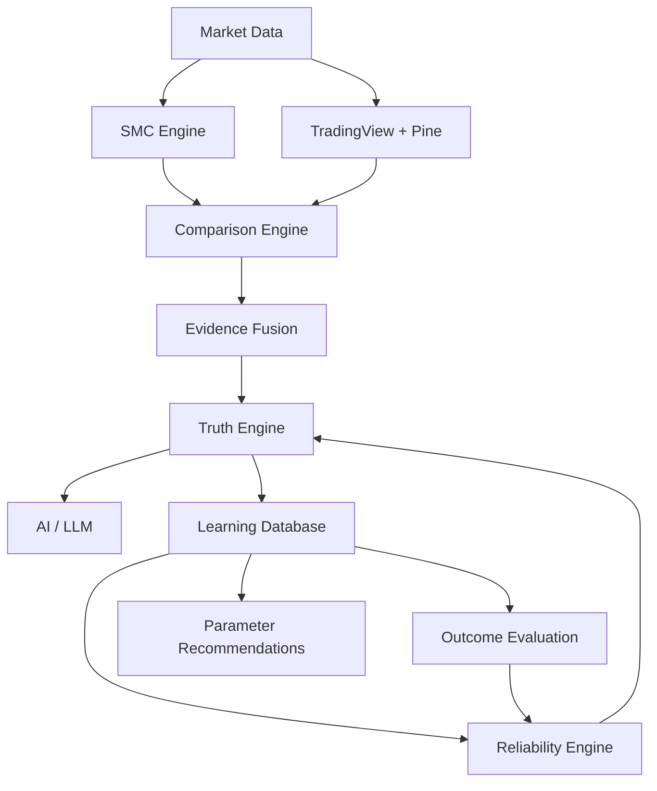

# SMC Pulse Predict — AI Trading Operating System

**Vision:** An evidence-driven, self-improving market intelligence platform that applies ICT/SMC methodology at scale.

## Core Architecture

## Key Components

| Component | File | Purpose |
|---|---|---|
| [[SMC Engine]] | `lib/smc/` | 7 detection modules (structure, liquidity, OB, FVG, PD array, daily bias, SMT) |
| [[AI Pipeline]] | `lib/llm/` + `lib/loop/` | LLM provider abstraction + Agent Loop engine |
| [[Comparison Engine]] | `lib/comparison/` | TV vs Engine detection matching |
| [[Evidence Fusion Layer]] | `lib/fusion/` | Composite confidence + explanations |
| [[Truth Engine]] | `lib/truth/` | Decision arbitration — who do I trust? |
| [[Learning Service]] | `lib/learning/` | DB persistence for all comparison data |
| [[Reliability Engine]] | `lib/reliability/` | Per-type reliability scoring |
| [[Outcome Evaluator]] | `lib/evaluation/` | Market outcome evaluation |
| [[Reflection Engine]] | `lib/reflection/` | Post-trade structured reflections |
| [[Parameter Recommender]] | `lib/optimization/` | Statistical parameter suggestions |
| [[TV Desktop Integration]] | `lib/integrations/tradingview-desktop/` | 86 MCP tools via chrome-remote-interface |
| [[MCP Server]] | `lib/mcp/` | FastMCP v4.3.2 — 11 SMC + 86 TV tools |

## Quick Links
- [[Complete Architecture Report]]
- [[Database Schema]]
- [[API Endpoints]]
- [[Setup Guide]]
